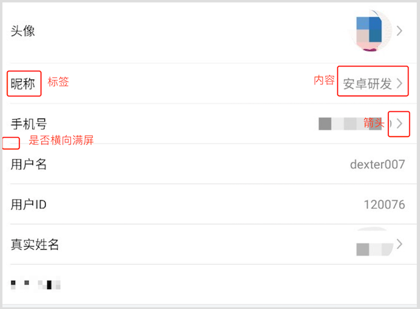

# DUI
## Download

Gradle:
```groovy
implementation 'com.github.DexterLin007:DUI:1.0'

```
## BaseItemLayout

### Attributes
|name|format|description|
|:---:|:---:|:---:|
| base_item_label | string/reference |设置标签
| base_item_label_color | string/reference |设置标签颜色
| base_item_text | string/reference |设置内容
| base_item_text_color | string/reference |设置内容颜色
| base_item_has_arrow | boolean |是否显示箭头
| base_item_line_full | boolean |是否分割线横向满屏
| base_item_clickable | boolean |是否可点击

### Dependence
*  [AndroidUtilCode](https://github.com/Blankj/AndroidUtilCode)
